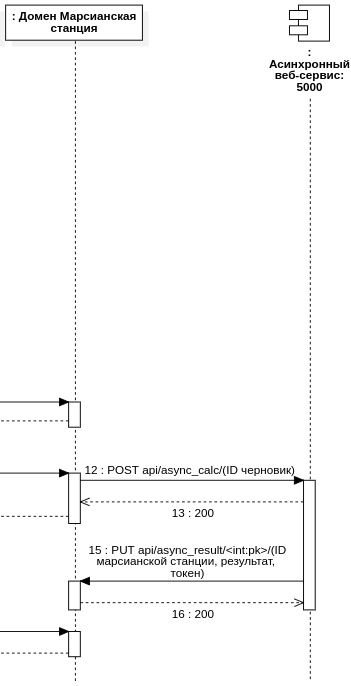

## Разработка Интернет Приложений

### Предметная область "Станции на поверхности Марса"

Описание лабораторной работы

- **Цель работы**: Знакомство с межсервисным взаимодействием и асинхронностью
- **Порядок показа**: вызвать через `insomnia`/`postman` http-метод асинхронного сервиса, показать что в основном приложении появился результат, потом вызвать метод основного сервиса напрямую, чтобы изменить результат
- **Контрольные вопросы**: grpc, асинхронность, веб-сервис
- **Задание**: Создание асинхронного сервиса для отложенного действия (вычисление, моделирование, оплата и тд)

Требуется разработать второй простой асинхронный сервис на другом языке (кто делал на Django - Go и наоборот) с одним http-методом для выполнения отложенного действия в вашей системе (вычисление, моделирование, оплата и тд). Действие выполняется с задержкой 5-10 секунд, результат сервиса случайный, например успех/неуспех, достаточно в результате обновить одно поле в `заявке`.

В исходном веб-сервисе также необходимо добавить http-метод для внесения результатов. Асинхронный сервис взаимодействует с основным через `http`, без прямого обращения в БД. Добавить псевдо авторизацию в методе основного сервиса - передавать как константу какой-нибудь ключ, например на 8 байт, и через if просто проверять на совпадение это поле.

* [Методические указания Django](/tutorials/lab8-py/README.md)
* [Методические указания Golang](/tutorials/lab8-go/README.md)

##### Схема

